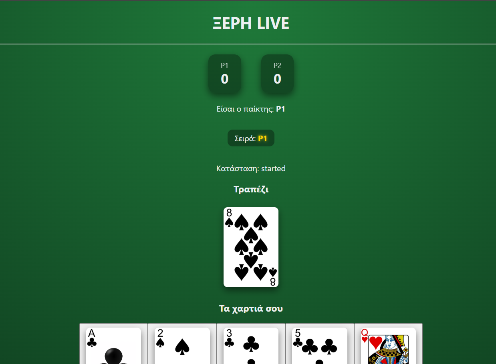
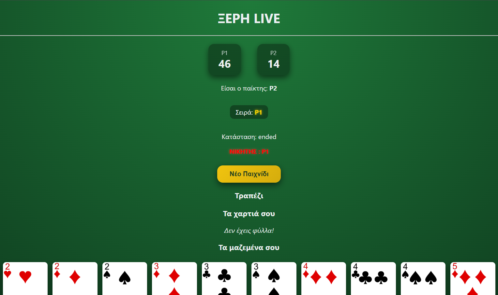

# ΞΕΡΗ – Web API Υλοποίηση Παιχνιδιού Καρτών

Το παρόν project αποτελεί υλοποίηση του παιχνιδιού καρτών **ΞΕΡΗ**, στο πλαίσιο ακαδημαϊκής εργασίας για το μάθημα **ΑΔΙΣΕ**.
Το παιχνίδι υποστηρίζει δύο παίκτες (**Human vs Human**) και βασίζεται σε αρχιτεκτονική **Web API**, χρησιμοποιώντας PHP, MySQL, JavaScript και AJAX.

---

## Γραφικό Περιβάλλον

Το γραφικό περιβάλλον λειτουργεί ως client του API και επικοινωνεί με το backend μέσω JSON αιτημάτων.

---

## Βασικά Χαρακτηριστικά

- Υποστήριξη δύο παικτών (Human vs Human)
- Turn-based gameplay
- Web API αρχιτεκτονική
- Επικοινωνία μέσω AJAX και JSON
- Authentication μέσω token
- Έλεγχος εγκυρότητας κινήσεων
- Υποστήριξη ΞΕΡΗΣ
- Υποστήριξη ΞΕΡΗΣ με J
- Παρακολούθηση σκορ
- Αποθήκευση της κατάστασης του παιχνιδιού σε MySQL
- Επανεκκίνηση παιχνιδιού

---

## Τεχνολογίες

### Backend

- PHP
- MySQL
- Web API
- JSON

### Frontend

- HTML5
- CSS3
- JavaScript
- AJAX

---

## Ροή Παιχνιδιού

1. Ο πρώτος παίκτης συνδέεται στο παιχνίδι.
2. Ο δεύτερος παίκτης συνδέεται και το παιχνίδι ξεκινά.
3. Οι παίκτες παίζουν εναλλάξ σύμφωνα με τη σειρά τους.
4. Το API ελέγχει την εγκυρότητα κάθε κίνησης.
5. Εφαρμόζονται οι κανόνες του παιχνιδιού και αναγνωρίζονται ειδικά γεγονότα, όπως η ΞΕΡΗ.
6. Το παιχνίδι ολοκληρώνεται όταν εξαντληθούν τα φύλλα ή κάποιος παίκτης αποσυνδεθεί.

